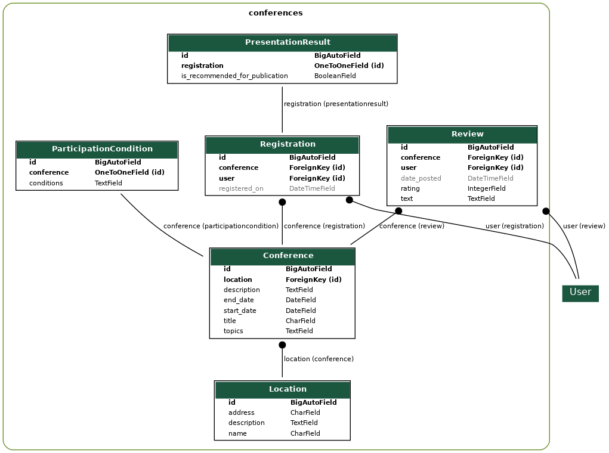

# Инструкция по тому, как я сделал лабораторную 2

## Шаг 1: Установка и настройка проекта

1. **Установите Django и создайте проект:**

   ```bash
   pip install django
   django-admin startproject conference_site
   cd conference_site
   ```

2. **Создайте приложение для конференций:**

   ```bash
   python manage.py startapp conferences
   ```

3. **Настройте подключение к PostgreSQL:**
   - Установите драйвер для PostgreSQL:

     ```bash
     pip install psycopg2-binary
     ```

   - Настройте базу данных в `settings.py`:

     ```python
     DATABASES = {
         'default': {
             'ENGINE': 'django.db.backends.postgresql',
             'NAME': 'your_db_name',
             'USER': 'your_db_user',
             'PASSWORD': 'your_db_password',
             'HOST': 'localhost',
             'PORT': '5432',
         }
     }
     ```

4. **Примените миграции:**

   ```bash
   python manage.py migrate
   ```

## Шаг 2: Создание моделей

1. **Создайте модели в `conferences/models.py`:**

   ```python
   from django.db import models
   from django.contrib.auth.models import User

   class Location(models.Model):
       name = models.CharField(max_length=255)
       address = models.CharField(max_length=255)
       description = models.TextField()

   class Conference(models.Model):
       title = models.CharField(max_length=255)
       topics = models.TextField()
       location = models.ForeignKey(Location, on_delete=models.CASCADE)
       start_date = models.DateField()
       end_date = models.DateField()
       description = models.TextField()

   class ParticipationCondition(models.Model):
       conference = models.OneToOneField(Conference, on_delete=models.CASCADE)
       conditions = models.TextField()

   class Registration(models.Model):
       user = models.ForeignKey(User, on_delete=models.CASCADE)
       conference = models.ForeignKey(Conference, on_delete=models.CASCADE)
       registered_on = models.DateTimeField(auto_now_add=True)

   class Review(models.Model):
       conference = models.ForeignKey(Conference, on_delete=models.CASCADE)
       user = models.ForeignKey(User, on_delete=models.CASCADE)
       text = models.TextField()
       rating = models.IntegerField(choices=[(i, str(i)) for i in range(1, 11)])
       date_posted = models.DateTimeField(auto_now_add=True)

   class PresentationResult(models.Model):
       registration = models.OneToOneField(Registration, on_delete=models.CASCADE)
       is_recommended_for_publication = models.BooleanField(default=False)
   ```

2. **Создайте и примените миграции:**

   ```bash
   python manage.py makemigrations conferences
   python manage.py migrate
   ```

## Шаг 3: Реализация функциональности

1. **Регистрация пользователей:**

   - Создайте форму регистрации в `conferences/forms.py`:

     ```python
     from django import forms
     from django.contrib.auth.forms import UserCreationForm
     from django.contrib.auth.models import User

     class UserRegisterForm(UserCreationForm):
         email = forms.EmailField(required=True)

         class Meta:
             model = User
             fields = ['username', 'email', 'password1', 'password2']
     ```

   - Создайте представление для регистрации в `conferences/views.py`:

     ```python
     from django.shortcuts import render, redirect
     from django.contrib import messages
     from .forms import UserRegisterForm

     def register(request):
         if request.method == 'POST':
             form = UserRegisterForm(request.POST)
             if form.is_valid():
                 form.save()
                 username = form.cleaned_data.get('username')
                 messages.success(request, f'Account created for {username}!')
                 return redirect('login')
         else:
             form = UserRegisterForm()
         return render(request, 'conferences/register.html', {'form': form})
     ```

   - Создайте шаблон `register.html` в `templates/conferences/`.

### Шаг 3: Реализация функциональности (продолжение)

2. **Просмотр и регистрация на конференции (продолжение):**

   - **Создайте представление для регистрации на конференцию:**

     ```python
     @login_required
     def register_for_conference(request, conference_id):
         conference = get_object_or_404(Conference, id=conference_id)
         registration, created = Registration.objects.get_or_create(user=request.user, conference=conference)

         if created:
             messages.success(request, f'You have successfully registered for {conference.title}.')
         else:
             messages.info(request, f'You are already registered for {conference.title}.')

         return redirect('conference_detail', conference_id=conference_id)
     ```

   - **Создайте представление для отмены регистрации:**

     ```python
     @login_required
     def unregister_from_conference(request, conference_id):
         conference = get_object_or_404(Conference, id=conference_id)
         registration = Registration.objects.filter(conference=conference, user=request.user).first()

         if registration:
             registration.delete()
             messages.success(request, f'You have successfully unregistered from {conference.title}.')
         else:
             messages.error(request, 'You are not registered for this conference.')

         return redirect('conference_detail', conference_id=conference_id)
     ```

   - **Создайте шаблоны `conference_list.html` и `conference_detail.html` в `templates/conferences/`.**

3. **Написание отзывов:**

   - **Создайте форму для отзывов в `forms.py`:**

     ```python
     from .models import Review

     class ReviewForm(forms.ModelForm):
         class Meta:
             model = Review
             fields = ['text', 'rating']
     ```

   - **Создайте представление для добавления отзыва:**

     ```python
     @login_required
     def add_review(request, conference_id):
         conference = get_object_or_404(Conference, id=conference_id)
         registration = Registration.objects.filter(conference=conference, user=request.user).exists()

         if not registration:
             messages.error(request, 'You must be registered and have attended the conference to leave a review.')
             return redirect('conference_detail', conference_id=conference_id)

         if request.method == 'POST':
             form = ReviewForm(request.POST)
             if form.is_valid():
                 review = form.save(commit=False)
                 review.conference = conference
                 review.user = request.user
                 review.save()
                 messages.success(request, 'Your review has been added!')
                 return redirect('conference_detail', conference_id=conference_id)
         else:
             form = ReviewForm()
         return render(request, 'conferences/add_review.html', {'form': form, 'conference': conference})
     ```

   - **Создайте шаблон `add_review.html` в `templates/conferences/`.**

4. **Настройка административной панели:**

   - **Зарегистрируйте модели в `admin.py`:**

     ```python
     from django.contrib import admin
     from .models import Conference, Location, Registration, PresentationResult

     @admin.register(Conference)
     class ConferenceAdmin(admin.ModelAdmin):
         list_display = ('title', 'location', 'start_date', 'end_date')
         search_fields = ('title', 'topics')

     @admin.register(Location)
     class LocationAdmin(admin.ModelAdmin):
         list_display = ('name', 'address')
         search_fields = ('name', 'address')

     @admin.register(Registration)
     class RegistrationAdmin(admin.ModelAdmin):
         list_display = ('user', 'conference', 'registered_on')
         search_fields = ('user__username', 'conference__title')

     @admin.register(PresentationResult)
     class PresentationResultAdmin(admin.ModelAdmin):
         list_display = ('registration', 'is_recommended_for_publication')
         list_filter = ('is_recommended_for_publication',)
     ```

## Шаг 4: Настройка URL-адресов

1. **Настройте URL-адреса в `urls.py` приложения `conferences`:**

   ```python
   from django.urls import path
   from django.contrib.auth import views as auth_views
   from . import views

   urlpatterns = [
       path('register/', views.register, name='register'),
       path('', views.conference_list, name='conference_list'),
       path('conference/<int:conference_id>/', views.conference_detail, name='conference_detail'),
       path('conference/<int:conference_id>/register/', views.register_for_conference, name='register_for_conference'),
       path('conference/<int:conference_id>/unregister/', views.unregister_from_conference, name='unregister_from_conference'),
       path('conference/<int:conference_id>/add_review/', views.add_review, name='add_review'),
       path('login/', auth_views.LoginView.as_view(template_name='conferences/login.html'), name='login'),
       path('logout/', auth_views.LogoutView.as_view(template_name='conferences/logout.html'), name='logout'),
   ]
   ```

## Шаг 5: Настройка шаблонов

1. **Создайте базовый шаблон `base_generic.html` в `templates`:**

   ```html
   <!DOCTYPE html>
   <html lang="en">
   <head>
       <meta charset="UTF-8">
       <meta name="viewport" content="width=device-width, initial-scale=1.0">
       <title>Conference Site</title>
       <link href="https://stackpath.bootstrapcdn.com/bootstrap/4.5.2/css/bootstrap.min.css" rel="stylesheet">
   </head>
   <body>
       <nav class="navbar navbar-expand-lg navbar-light bg-light">
           <a class="navbar-brand" href="#">Conference Site</a>
           <div class="collapse navbar-collapse" id="navbarNav">
               <ul class="navbar-nav">
                   <li class="nav-item">
                       <a class="nav-link" href="">Conferences</a>
                   </li>
                   
                       <li class="nav-item">
                           <form method="POST" action="" style="display: inline;">
                               
                               <button type="submit" class="btn btn-link nav-link" style="display: inline; padding: 0; border: none; background: none;">Logout</button>
                           </form>
                       </li>
                   
                       <li class="nav-item">
                           <a class="nav-link" href="">Login</a>
                       </li>
                       <li class="nav-item">
                           <a class="nav-link" href="">Register</a>
                       </li>
                   
               </ul>
           </div>
       </nav>
       <div class="container">
           
           
       </div>
   </body>
   </html>
   ```

Итоговая структура построили с помощью pygraphviz:

