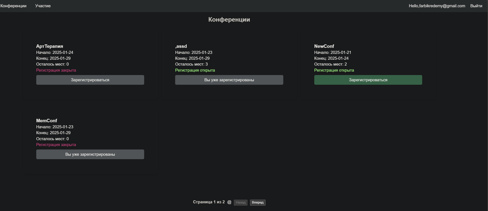
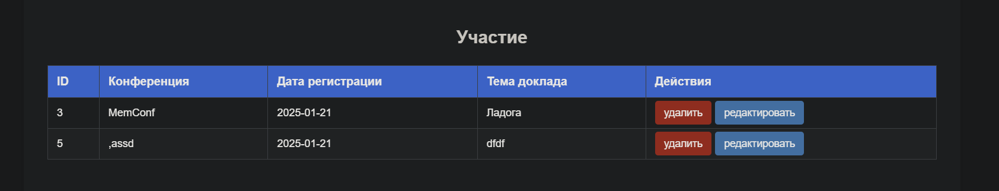

# Лабораторная работа №4. Реализация фронтенда для веб-сервиса «Конференции» с помощью Vue

## ConferenceList
### Template
```html
    <Base />
    <Participation :show_list="true" ref="create" @update-state="showList"/>
    <h1 v-if="show_list" style="text-align: center;">Конференции</h1>
    <div v-if="show_list" class="conferences__container">
        <div class="conferences__card" v-for="conferences in paginated">
            <div><span style="font-size: large; font-weight: bold;">{{ conferences.name }}</span></div>
            <div><span>Начало: {{ conferences.start_date }}</span></div>
            <div><span>Конец: {{ conferences.end_date }}</span></div>
            <div><span>Осталось мест: {{ conferences.free_places }}</span></div>
            <div>
                <span v-if="!conferences.is_registration_opened || conferences.free_places == 0" style="color: #E40066;">Регистрация закрыта</span>
                <span v-else style="color: green;">Регистрация открыта</span> <br>
                <button v-if="user_conferences.includes(conferences.id)" class="no_participation__button">Вы уже зарегистрированы</button>
                <button v-else-if="!conferences.is_registration_opened || conferences.free_places == 0" class="no_participation__button">Зарегистрироваться</button>
                <button v-else class="participation__button" @click="showParticipation(conferences)">Зарегистрироваться</button>
            </div>
        </div>
    </div>
    <div v-if="show_list" class="pag__btns">
        <label>Страница {{ page+1 }} из {{ max_page+1 }}</label>@
        <button v-if="page==0" disabled @click="prev()">Назад</button>
        <button v-else @click="prev()">Назад</button>
        <button v-if="page==max_page" disabled @click="next()">Вперед</button>
        <button v-else @click="next()">Вперед</button>
    </div>
```
### Script
```js
    import axios from "axios";
    import Base from '@/components/Base.vue'
    import Participation from "@/components/Participation.vue";
    
    export default {
        components: {
            Base, Participation
        },
        name: "Conferences",
        data() {
            return {
                all_conferences: [],
                paginated: [],
                page: 0,
                max_page: Number,
                conferences_per_page: 6,
                selected_conferences: "",
                show_list: true,
            }
        },
        methods: {
            showParticipation: function (conferences) {
                const user = JSON.parse(localStorage.getItem('user'));
                if (user) {
                    this.$refs.create.name = conferences.name
                    this.$refs.create.show = true
                    this.$refs.create.participation.conference = conferences.id
                    this.show_list = false
                } else {
                    this.$router.push('/login');
                }
                
            },
            showList() {
                this.$refs.create.show = false
                this.show_list = true
            },
            paginate() {
                let start = this.conferences_per_page * this.page
                let end = Math.min(start + this.conferences_per_page, this.all_conferences.length)
                this.paginated = this.all_conferences.slice(start, end)
            },
            next() {
                this.page++
                this.paginate()
            },
            prev() {
                if (this.page > 0)
                    this.page--
                this.paginate()
            },
            async fetchConferenceList () {
                try {
                    const response = await axios.get('http://127.0.0.1:8000/conferences/list/');
                    const user = JSON.parse(localStorage.getItem('user'));
                    const second_response = await axios.get(`http://127.0.0.1:8000/users/${user.id}/conferences/`);
                    this.user_conferences = second_response.data.map(conference => conference.id)
                    this.all_conferences = response.data
                    this.max_page =  Math.round(this.all_conferences.length / this.conferences_per_page)
                    this.paginate()
                } catch (e) {
                    if (e.response) {
                        switch (e.response.status) {
                            case 404:
                                break;
                            default:
                                alert('Ошибка ответа!');
                        } 
                    } else if (e.request) {
                        alert('Ошибка запроса!');
                    }
                }
            }
        },
        mounted() {
            this.fetchConferenceList() 
        }
    }
```

### Review

Сделал прикольный список конференций, проработана логика с учётом, куда регался юзер.


## ParticipationList
### Template
```html
    <Base/>
    <DeleteParticipation ref="del"/>
    <UpdateParticipation ref="upt"/>
    <div v-if="this.user" class="participation__history__container">
    <h1>Участие</h1>
    <table class="participation__table">
        <thead>
            <tr>
                <th>ID</th>
                <th>Конференция</th>
                <th>Дата регистрации</th>
                <th>Статус</th>
                <th>Действия</th>
            </tr>
        </thead>
        <tbody>
            <tr v-for="participation in participations" :key="participation.id">
                <td>{{ participation.id }}</td>
                <td>{{ participation.conference }}</td>
                <td>{{ participation.registration_date }}</td>
                <td>{{ participation.from_town }}</td>
                <td v-if="participation.from_town != 'finished'">
                    <a class="action__button delete__button" @click="showModalDelete(participation.id)">удалить</a> 
                    <a class="action__button edit__button" @click="showModalUpdate(participation.id)">редактировать</a> 
                </td>
                <td v-if="participation.from_town == 'finished'"> нельзя внести изменения </td>
            </tr>
        </tbody>
    </table>
    </div>
```

### Script

```js
    import Base from '@/components/Base.vue';
    import DeleteParticipation from '@/components/DeleteParticipation.vue';
    import UpdateParticipation from '@/components/UpdateParticipation.vue';
    import axios from 'axios';

    export default {
        name: 'ParticipationList',
        components: {
            Base, DeleteParticipation, UpdateParticipation
        },
        data() {
            return {
                participations: [],
                user: {}
            }
        },
        methods: {
            showModalDelete: function (id) {
                this.$refs.del.show = true
                this.$refs.del.participationId = id
            },
            showModalUpdate: function (id) {
                this.$refs.upt.show = true
                this.$refs.upt.participationId = id
            },
            async fetchUserParticipation() {
                this.user = JSON.parse(localStorage.getItem('user'));
                try {
                    const response = await axios.get(`http://127.0.0.1:8000/users/${this.user.id}/participation`);
                    this.participations = response.data;
                    console.log(this.participations);
                    this.participations.forEach(async (participation) => {
                        const conference_resp = await axios.get(`http://127.0.0.1:8000/conferences/${participation.conference}/`);
                        participation.conference = conference_resp.data.name;
                    });
                } catch (e) {
                    if (e.response) {
                        switch (e.response.status) {
                            case 401:
                                this.user = {};
                                break;
                            default:
                        }
                    }
                }
            }
        }, 
        mounted() {
            this.fetchUserParticipation()
        }
    }
```


Вторая основная сущность, из которой можно редактировать свои участия
