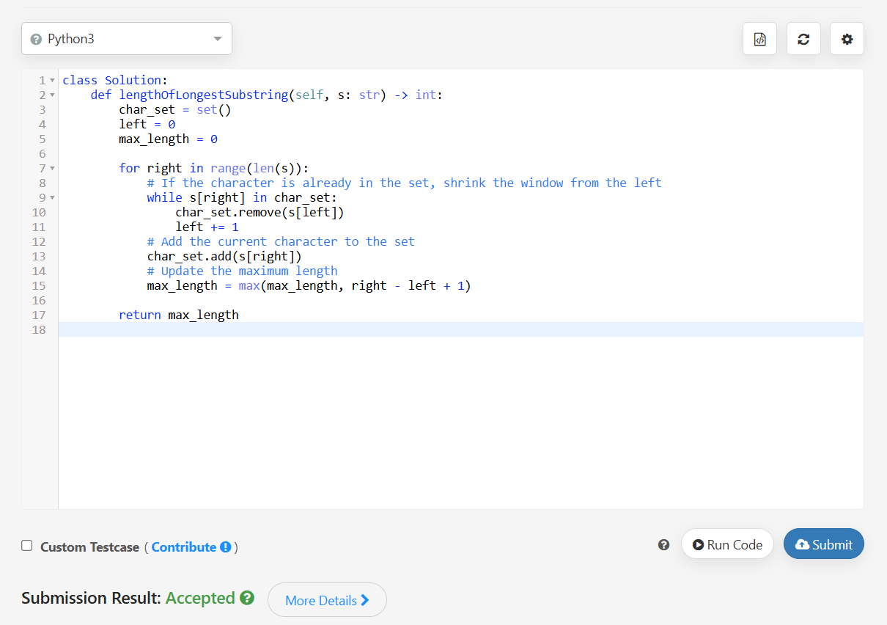
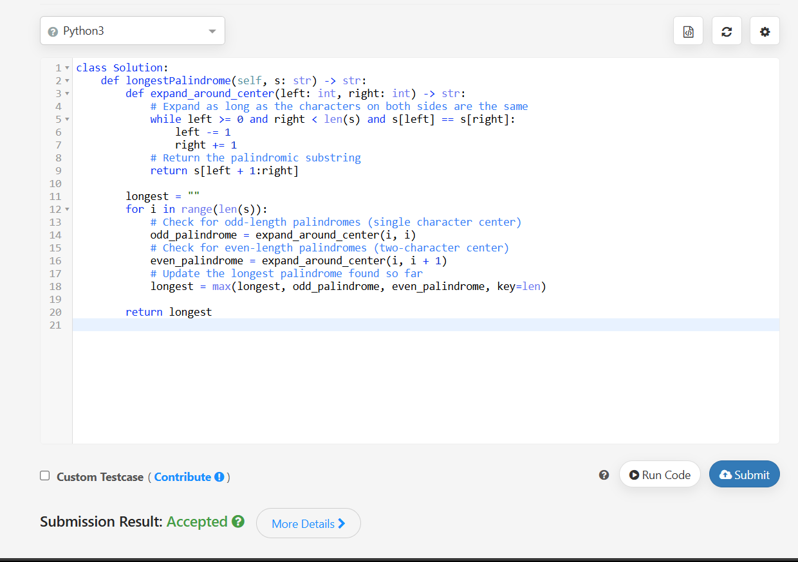
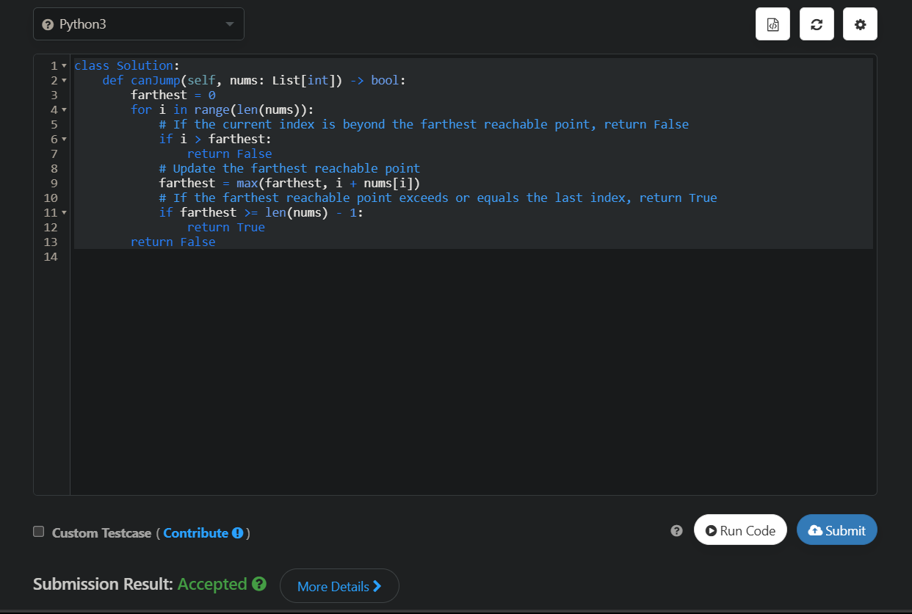
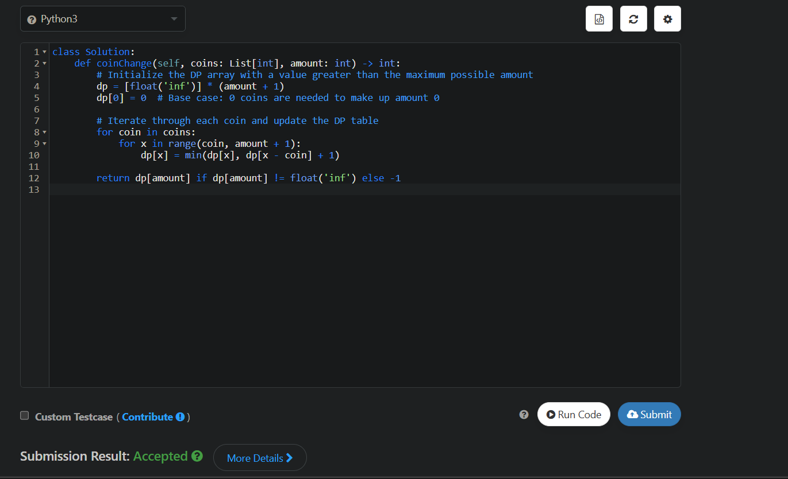

## [Task 1](https://leetcode.com/explore/interview/card/top-interview-questions-medium/103/array-and-strings/779/)

Given a string s, find the length of the longest substring without repeating characters.

Example 1:

Input: s = "abcabcbb"
Output: 3
Explanation: The answer is "abc", with the length of 3.
Example 2:

Input: s = "bbbbb"
Output: 1
Explanation: The answer is "b", with the length of 1.
Example 3:

Input: s = "pwwkew"
Output: 3
Explanation: The answer is "wke", with the length of 3.
Notice that the answer must be a substring, "pwke" is a subsequence and not a substring.

### Solution

```python
class Solution:
    def lengthOfLongestSubstring(self, s: str) -> int:
        char_set = set()
        left = 0
        max_length = 0
    
        for right in range(len(s)):
            # If the character is already in the set, shrink the window from the left
            while s[right] in char_set:
                char_set.remove(s[left])
                left += 1
            # Add the current character to the set
            char_set.add(s[right])
            # Update the maximum length
            max_length = max(max_length, right - left + 1)
    
        return max_length

```

## [Task 2](https://leetcode.com/explore/interview/card/top-interview-questions-medium/103/array-and-strings/780/)

Given a string s, return the longest palindromic substring in s.

Example 1:

Input: s = "babad"
Output: "bab"
Explanation: "aba" is also a valid answer.
Example 2:

Input: s = "cbbd"
Output: "bb"



### Solution

```python
class Solution:
    def longestPalindrome(self, s: str) -> str:
        def expand_around_center(left: int, right: int) -> str:
            # Expand as long as the characters on both sides are the same
            while left >= 0 and right < len(s) and s[left] == s[right]:
                left -= 1
                right += 1
            # Return the palindromic substring
            return s[left + 1:right]
    
        longest = ""
        for i in range(len(s)):
            # Check for odd-length palindromes (single character center)
            odd_palindrome = expand_around_center(i, i)
            # Check for even-length palindromes (two-character center)
            even_palindrome = expand_around_center(i, i + 1)
            # Update the longest palindrome found so far
            longest = max(longest, odd_palindrome, even_palindrome, key=len)
    
        return longest
```

## [Task 3](https://leetcode.com/explore/interview/card/top-interview-questions-medium/111/dynamic-programming/807/)

You are given an integer array nums. You are initially positioned at the array's first index, and each element in the array represents your maximum jump length at that position.

Return true if you can reach the last index, or false otherwise.

 

Example 1:

Input: nums = [2,3,1,1,4]
Output: true
Explanation: Jump 1 step from index 0 to 1, then 3 steps to the last index.
Example 2:

Input: nums = [3,2,1,0,4]
Output: false
Explanation: You will always arrive at index 3 no matter what. Its maximum jump length is 0, which makes it impossible to reach the last index.
 
Constraints:

1 <= nums.length <= 104
0 <= nums[i] <= 105


### Solution

```python
class Solution:
    def canJump(self, nums: List[int]) -> bool:
        farthest = 0
        for i in range(len(nums)):
            # If the current index is beyond the farthest reachable point, return False
            if i > farthest:
                return False
            # Update the farthest reachable point
            farthest = max(farthest, i + nums[i])
            # If the farthest reachable point exceeds or equals the last index, return True
            if farthest >= len(nums) - 1:
                return True
        return False

```

## [Task 4](https://leetcode.com/explore/interview/card/top-interview-questions-medium/111/dynamic-programming/807/)

You are given an integer array coins representing coins of different denominations and an integer amount representing a total amount of money.

Return the fewest number of coins that you need to make up that amount. If that amount of money cannot be made up by any combination of the coins, return -1.

You may assume that you have an infinite number of each kind of coin.

 

Example 1:

Input: coins = [1,2,5], amount = 11
Output: 3
Explanation: 11 = 5 + 5 + 1
Example 2:

Input: coins = [2], amount = 3
Output: -1
Example 3:

Input: coins = [1], amount = 0
Output: 0
 

Constraints:

1 <= coins.length <= 12
1 <= coins[i] <= 231 - 1
0 <= amount <= 104

### Solution

```python
class Solution:
    def coinChange(self, coins: List[int], amount: int) -> int:
        # Initialize the DP array with a value greater than the maximum possible amount
        dp = [float('inf')] * (amount + 1)
        dp[0] = 0  # Base case: 0 coins are needed to make up amount 0
    
        # Iterate through each coin and update the DP table
        for coin in coins:
            for x in range(coin, amount + 1):
                dp[x] = min(dp[x], dp[x - coin] + 1)
    
        return dp[amount] if dp[amount] != float('inf') else -1


```
